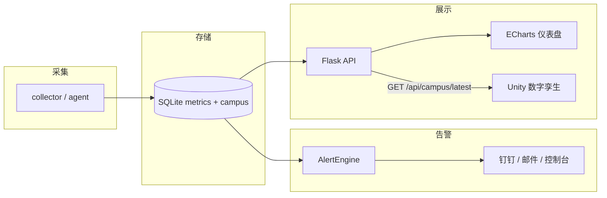

# 服务器监控告警系统 · ops-monitor

一台服务器上的「体检仪 + 报警器」：采集 → 存储 → 可视化 → 阈值告警 → 钉钉/邮件通知 → Docker 部署。

[](https://www.python.org/)
[](https://flask.palletsprojects.com/)
[](https://www.docker.com/)
[](https://www.sqlite.org/)
[](https://echarts.apache.org/)

## 功能亮点

- **完整链路**：采集 → SQLite → ECharts 仪表盘 → P0/P1/P2 告警 → 钉钉通知 → Docker
- **状态机降噪**：仅在触发与恢复两个边沿各发一次，持续超阈值不刷屏
- **进程快照**：CPU 高负载触发时抓取 Top 5 进程，定位「谁占着资源」
- **多节点监控**：agent 主动上报 + 中心端统一告警，节点维度隔离状态机
- **校园数字孪生模块**：独立 Blueprint + 业务指标表，给 Unity 实时态势供数
- **校园告警也走钉钉**：标题带 `[校园]`，与主机告警同一套 Notifier

## 架构



## 快速开始

```bash
# Docker（推荐）
docker compose up -d --build
# 打开 http://localhost:5000

# 或本机 Python
pip install -r requirements.txt
cp .env.example .env   # 填入钉钉 Webhook 等
python run.py
```

校园演示（免 Docker）：`一键启动校园演示-免Docker.bat`，访问 `/campus`。

## 主要 API

| 接口 | 说明 |
|------|------|
| `GET /api/metrics/latest` | 最新指标（支持 `?node=`） |
| `GET /api/metrics/range` | 时间范围聚合序列 |
| `GET /api/alerts/active` | 未恢复告警 |
| `POST /api/ingest` | 多节点 agent 上报 |
| `GET /api/campus/latest` | 校园 10 楼扁平快照（供 Unity） |

## 配置

敏感项（钉钉 Webhook / SMTP）只放 `.env`，仓库内仅保留 `.env.example`：

```bash
DINGTALK_WEBHOOK=...
CAMPUS_NOTIFY=1    # 校园告警是否推送，压测可设 0
```

## 目录结构

```
ops-monitor/
├─ run.py / app.py / agent.py
├─ collector.py / storage.py / alert.py / notify.py / config.py
├─ campus_*.py / campus_simulator/     # 校园孪生模块
├─ templates/ static/                  # 深色仪表盘
├─ scripts/                            # 告警链路演练
├─ Dockerfile / docker-compose.yml
└─ data/                               # SQLite（不入库）
```

## License

MIT
