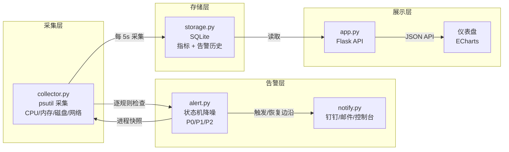
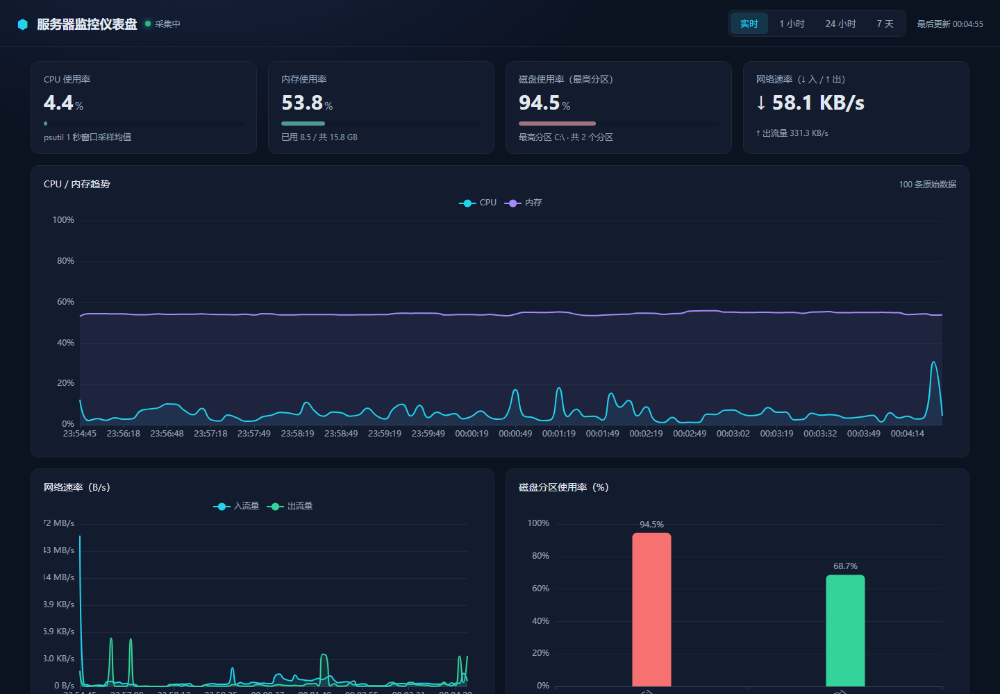
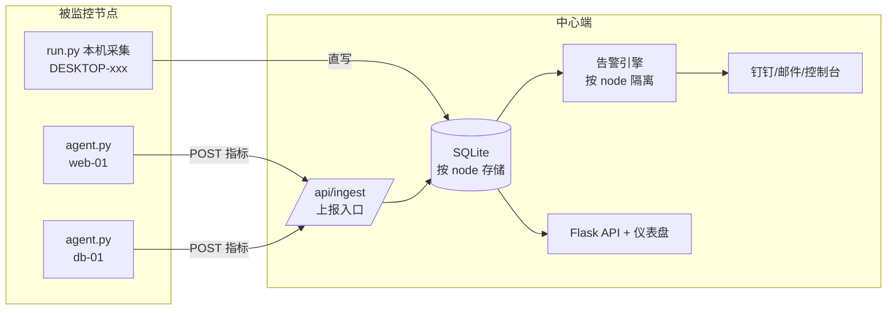

# 服务器监控告警系统

> 一台服务器上的「体检仪 + 报警器」：定时采集 CPU / 内存 / 磁盘 / 网络指标 → Web 可视化 → 阈值告警（钉钉 / 邮件）→ 历史数据留存。
>
> 面向运维 / SRE 岗位求职，覆盖 **完整开发 → Docker 部署 → 上线规划** 全流程。

[](#)
[](#)
[](#)
[](#)
[](#)
[](#)

## 项目亮点（面试一句话总结）

- **完整链路**：采集 → 存储 → 可视化 → 告警 → 通知 → 部署，单机监控系统从零落地
- **状态机降噪**：告警只在「触发」和「恢复」两个时刻各发一次通知，持续期间绝不刷屏
- **进程快照**：CPU 高负载告警触发时自动抓 Top 5 进程，告警不止告诉你「出事了」，还告诉你「是谁干的」
- **容器监控宿主机**：踩透 Docker 命名空间穿透的坑（`--pid=host` / `--network=host` / 挂载根目录 + 过滤容器视角伪挂载点）
- **配置与代码分离**：敏感密钥（钉钉 Webhook / SMTP）走环境变量 + `.env`，仓库里永远没有真实密钥

## 技术栈

| 层 | 选型 | 理由 |
|----|------|------|
| 采集 | Python 3.13 + psutil | 运维脚本生态主流；psutil 是跨平台系统信息标准库 |
| Web | Flask | 轻量；本项目 API 简单，不需要 Django 的复杂度 |
| 存储 | SQLite | 单机零依赖；分钟级数据量足够 |
| 可视化 | ECharts（本地离线） | 深色监控风；离线可用，无需 CDN |
| 告警 | 钉钉机器人 + SMTP 邮件 | 多渠道可插拔；未配置自动降级为控制台 |
| 部署 | Docker + docker-compose | 一键编排、数据持久化、健康探活 |

## 架构图



**部署形态**：`run.py` 后台采集线程 + Flask Web 服务，单进程双线程；Docker 容器化后由 docker-compose 编排（`restart: unless-stopped` + healthcheck）。

## 功能规划

- [x] 里程碑 1：指标采集（CPU/内存/磁盘/网络）+ 存储 + Web API
- [x] 里程碑 2：Web 仪表盘（ECharts 实时曲线 + 历史趋势 + 时间范围切换 + 服务端抽稀聚合）
- [x] 里程碑 3：阈值告警（分级 P0/P1/P2 + 钉钉/邮件 + 状态机降噪 + 重启自愈）
- [x] 里程碑 4：实战细节（CPU 高负载进程快照 ✅ / 压测演练脚本 ✅ / 磁盘自动清理 ⏸ 搁置）
- [x] 里程碑 5：Docker 化 + 部署文档（容器化 ✅ / 云服务器上线 ⏳ 找工作前 1~2 个月）
- [x] 里程碑 6（多节点监控）：agent 主动上报 + 中心端聚合 + 告警按节点隔离 + 仪表盘节点切换
- [ ] 里程碑 7：技术博客 + 简历包装 + 面试预演

## 仪表盘



- 深色监控风单页仪表盘，本地引入 echarts.min.js（离线可用）
- 实时指标卡片：CPU / 内存 / 磁盘（最高分区）/ 网络速率，颜色随阈值变化（绿/黄/红）
- 图表：CPU 与内存双曲线、网络收发流量、磁盘各分区柱状图
- 时间范围切换：实时（10 分钟窗口）/ 1 小时 / 24 小时 / 7 天
- **服务端抽稀聚合**：7 天约 12 万条原始数据按时间桶取均值压缩到 300 个点再下发，前端不卡顿

## 多节点监控（里程碑 6）

架构从「单机 push」升级为「agent 主动上报 + 中心端聚合」，对标 Zabbix agent / Prometheus exporter：



- **agent.py**：轻量上报进程，复用 collector 采集逻辑，标准库 urllib POST 到 `/api/ingest`（不引入 requests）
- **中心端统一判定告警**：告警规则集中管理、通知统一出口；状态机按 `(node, level, metric, target)` 隔离，不同节点同类告警互不干扰
- **数据模型加 node 维度**：metrics / alerts 表加 `node` 列，所有 API 支持 `?node=` 过滤
- **仪表盘节点切换**：顶栏下拉选择节点（或全部），指标卡片/曲线/告警全部联动
- 启动：`python agent.py --server http://中心端:5000 --node web-01 --interval 5`

> 面试延伸：中心端单点（中心端挂了告警也没了）→ 引出高可用 / 分布式话题。

## 告警功能

- 三级规则（config.py 可调）：P0（CPU>95% 连续 2 次采样）、P1（内存>90%）、P2（磁盘>85%，逐分区）
- **状态机降噪**：正常 → 触发（发首条）→ 持续（静默只更新峰值）→ 恢复（发恢复通知）
- **进程快照**：P0 CPU 告警触发边沿抓一次 Top 5 进程，通知正文 + 仪表盘横幅/历史内联展示
- 告警历史入库（alerts 表），仪表盘展示活跃告警横幅 + 最近告警列表
- 通知渠道可插拔：钉钉机器人 Webhook + SMTP 邮件，未配置时自动降级为控制台输出
- **重启自愈**：进程重启后从数据库恢复未结束的告警，不重复发、还能继续等恢复
- 演练工具：`python scripts/trigger_test.py`（喂假数据端到端验证全链路）

## 快速开始

### 方式一：Docker（推荐）

```bash
cd ops-monitor
docker compose up -d --build   # 首次加 --build 构建镜像
# 浏览器打开 http://localhost:5000
docker compose logs -f         # 看日志
docker compose down            # 停止
```

> Windows 下双击项目根目录的 `启动监控.bat` / `停止监控.bat`（自动检测引擎/容器/端口，一键起停）。

### 方式二：Python 直接跑

```bash
pip install -r requirements.txt
cp .env.example .env           # 按需填入钉钉 Webhook / SMTP
python run.py
# 打开 http://127.0.0.1:5000
```

## API

| 接口 | 说明 |
|------|------|
| `POST /api/ingest` | agent 上报入口，接收 `{node, metric}` |
| `GET /api/nodes` | 所有已知节点列表（含最近活跃时间/条数） |
| `GET /api/metrics/latest` | 最新一条指标（含内存已用/总量 GB、磁盘各分区），可按 `?node=` 过滤 |
| `GET /api/metrics/history?limit=N` | 最近 N 条原始记录（默认 500，上限 5000） |
| `GET /api/metrics/range?minutes=N&max_points=M` | 最近 N 分钟聚合序列，超过 M 个点按时间桶取均值抽稀 |
| `GET /api/alerts/active` | 当前未恢复的告警 |
| `GET /api/alerts?limit=N` | 最近 N 条告警记录（含已恢复），默认 50 |

## 目录结构

```
ops-monitor/
├─ run.py            # 启动入口（后台采集线程 + 告警检查 + Web 服务）
├─ agent.py          # 多节点监控 agent（上报本机指标到中心端，里程碑 6）
├─ config.py         # 配置（采集周期、告警阈值、通知渠道、数据路径）
├─ collector.py      # 指标采集器（psutil + 进程快照 + 伪挂载点过滤）
├─ storage.py        # SQLite 存储（指标 + 告警历史，含时间桶聚合抽稀）
├─ alert.py          # 告警引擎（状态机 + 降噪 + 恢复通知 + 重启自愈）
├─ notify.py         # 通知模块（钉钉 / 邮件 / 控制台降级）
├─ app.py            # Flask 应用（API + 页面）
├─ Dockerfile        # 镜像构建（多阶段分层缓存 + 时区上海）
├─ docker-compose.yml# 编排（数据挂载 + healthcheck + env_file 注入）
├─ requirements.txt  # 依赖（psutil / flask）
├─ .env.example      # 配置模板（.env 已 gitignore，不提交真实密钥）
├─ scripts/
│  └─ trigger_test.py# 告警链路演练脚本（喂假数据端到端验证）
├─ templates/
│  └─ dashboard.html # 仪表盘页面
├─ static/
│  ├─ echarts.min.js # 本地 ECharts（离线可用）
│  ├─ dashboard.css  # 深色监控风样式
│  └─ dashboard.js   # 前端逻辑（轮询/图表/告警区）
├─ docs/
│  └─ dashboard.png  # 仪表盘截图
├─ PLAN.md           # 方案文档（技术选型 + 面试题库）
├─ DEPLOY.md         # 部署文档（含容器监控宿主机命名空间穿透坑）
└─ data/
   └─ metrics.db     # SQLite 数据（已 gitignore）
```

## 更多文档

- [PLAN.md](PLAN.md) — 项目设计说明 + 技术选型理由 + 面试预演问题清单
- [DEPLOY.md](DEPLOY.md) — 部署文档，含「容器监控宿主机」命名空间穿透的关键面试点
